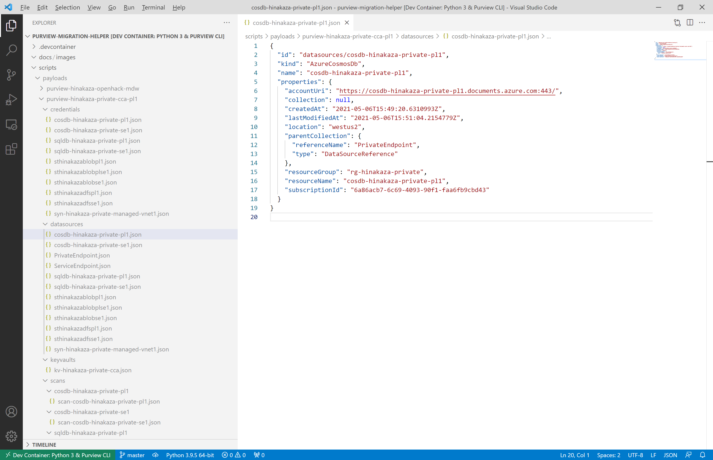

# purview-migration-helper
The scripts of this repo enable to export and import resources under [Azure Purview](https://docs.microsoft.com/en-us/azure/purview/overview ) account.

## Requirements
The scripts rely on Purview CLI and jq. Follow each product's guide for installation and configuration.

- [tayganr/purviewcli: Azure Purview CLI](https://github.com/tayganr/purviewcli)
- [jq](https://stedolan.github.io/jq/)

## Usage
The `scripts` directory contains `purview-migration-helper.sh` and sample scripts. By giving the helper script Purview CLI's read commands, you can export Purview resources as JSON format payloads. You can use these payloads as input for Purview CLI's put commands. You can use the export and import sample scripts in the `scripts` directory with just a little rewriting to fit your environment.

The following image shows exported JSON payloads. Each JSON file contains a single JSON payload, and each file can be specified as input to Purview CLI put commands.

## Notes
The helper script and export & import sample scripts in this repository have been tested for the following Purview CLI version and commands.

- Purview CLI version: `0.1.17`
- Purview CLI read commands:
    - `pv scan readKeyVaults`
    - `pv credential read`
    - `pv scan readDatasources`
    - `pv scan readScans`
- Purview CLI put commands:
    - `pv scan putKeyVault`
    - `pv credential put`
    - `pv scan putDataSource`
    - `pv scan putScan`